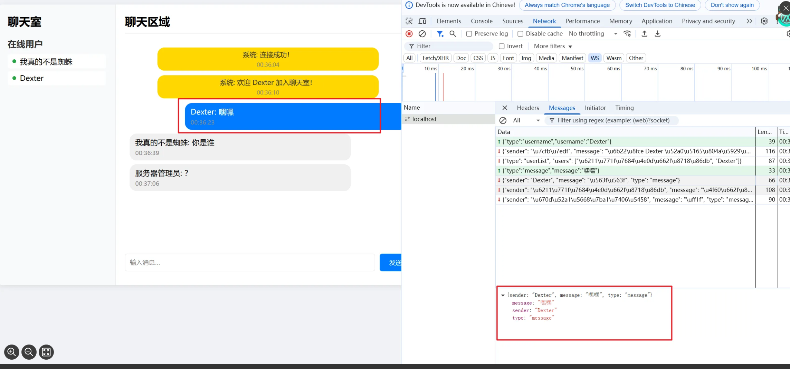
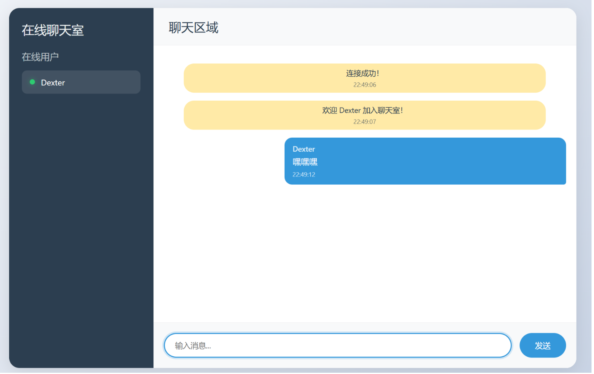

# Chatbox

基于websocket的聊天室，使用protohuf进行存储数据，适合初学者使用，本系列本旨为讲解如何利用websocket和protobuf手搓聊天室，并如何破解这种加密，分为三阶段，第一阶段讲解**websocket**和**protobuf**相关知识，并**手搓简单Chatbox**（也即本文），第二阶段为如何讲解实现**websocket爬虫**（讲解抖音直播弹幕，b站直播弹幕等），第三阶段为**不断完善Chatbox**，形成可投入产品。代码讲放在github，分为不同阶段不同版本

版本1.0：

- 简单的前端界面（有点丑）,
- 实现了用户组，和实时界面功能
- 使用json定义数据结构

版本2.0：

- 主要使用protobuf来定义数据
- 间接实现了ws加密

版本3.0:

- 使用gzip压缩数据
- 使用ping机制保持长链接
- 使用ack机制保证消息联通

公众号/CSDN：我真的不是蜘蛛
